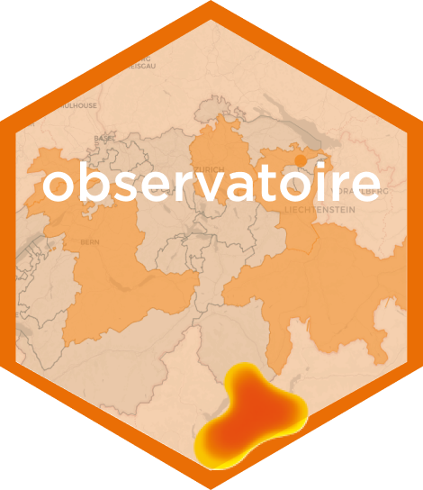
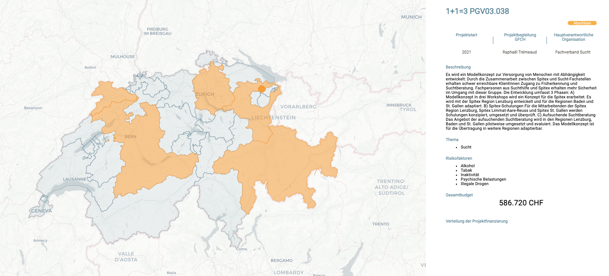

<!-- README.md is generated from README.Rmd. Please edit that file -->

# {exploratorium} 

<!-- badges: start -->

<!-- badges: end -->

# Overview

An attractive and playful **platform** for citizens and the federal
government to explore the **projects supported in the promotion of
diseases in Switzerland**.

# Access to the app

The app is deployed on shinyapps.io.

The **prod** app: [prod
version](https://prevention.shinyapps.io/exploratorium/)

The **dev** app (only for the dev team and key business users): [dev
version](https://prevention.shinyapps.io/exploratorium-dev/)

# Documentation

The technical documentation for the developers is available in the
[pkgdown](https://promotionsante.pages.thinkr.fr/exploratorium). You
will find global information about:

- The architecture of the app
- How to **update and modify the data used by the app**
- How to manually deploy the app on shinyapps.io
