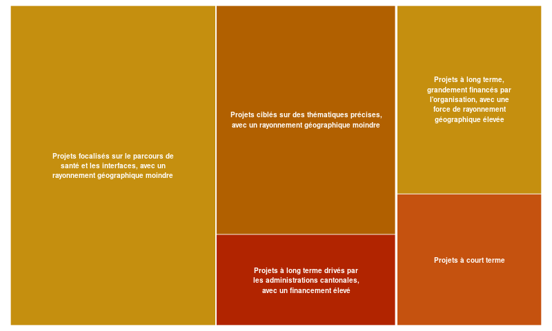

```{r, include=FALSE}
knitr::opts_chunk$set(
  echo = FALSE,
  fig.width = 7
)
```

```{r include=FALSE, message=FALSE}
library(readxl)
library(readr)
library(janitor)
library(dplyr)
library(stringr)
library(lubridate)
library(FactoMineR)
```

```{r echo=FALSE, message=FALSE}
pkgload::load_all()

# Import des données brutes
data_psch <- read_excel(
  path = system.file("PGV.xlsx", package = "exploratorium")
)

# Import du dictionnaire des variables
dic_variables <- read_csv(
  file = system.file("dic_variables.csv", package = "exploratorium"),
  show_col_types = FALSE
)

# Nettoyage des données
## Retirer le premier rang qui contient certains noms de colonnes en Français
data_psch <- data_psch[-1, ] 

## Remplacer les noms de colonnes allemands par les noms français.
colnames(data_psch) <- dic_variables$fr[
  match(
    dic_variables$de, 
    names(data_psch)
  )
]

## Simplifier les noms de colonnes (retirer majuscules et espaces)
data_psch <- janitor::clean_names(data_psch)

## Convertir les colonnes traitant du budget au format numérique
data_psch <- data_psch |> 
  mutate(
    across(
      starts_with("budget"),
      as.numeric
    )
  )

## Traduction de certaines colonnes en Français
data_psch <- data_psch |> 
  mutate(
    statut = case_when(
      statut == "Umsetzung" ~ "Mise en oeuvre",
      statut == "Abschluss" ~ "Finalis\u00e9",
      statut == "Abbruch" ~ "Interrompu"
    ),
    domaine_de_soutien = case_when(
      domaine_de_soutien == "Direkte Zusammenarbeit" ~ "Collaboration directe",
      domaine_de_soutien == "Folgemandat" ~ "Mandat de suivi",
      domaine_de_soutien == "F\u00f6rderbereich I" ~ "Domaine de financement I",
      domaine_de_soutien == "F\u00f6rderbereich II" ~ "Domaine de financement II",
      domaine_de_soutien == "F\u00f6rderbereich III" ~ "Domaine de financement III",
      domaine_de_soutien == "F\u00f6rderbereich IV" ~ "Domaine de financement IV"
    )
  )
```

### Contexte de l'étude

Il s'agit ici d'étudier les *profils* des 62 projets menés par Promotion Santé Suisse ces 4 dernières années dans le cadre de la prévention dans le domaine des soins. 

Au travers de cette étude, plusieurs questions sont sous-jacentes : 

- Existe-t-il des similitudes et des différences entre les différents projets ? 
- Sur quels critères se basent ces similitudes et ces différences ? 
- Existe-t-il des groupes de projets homogènes *(clusters)* ? 


### Présentation des données incluses dans l'étude

```{r echo=FALSE, message=FALSE}
data_explo <- data_psch |> 
  mutate(
    annee_debut = as.factor(
      year(debut_du_projet)
    )
  ) |> 
  mutate(
    duree_annees = round(
      as.numeric(
        difftime(
          fin_du_projet, 
          debut_du_projet, 
          units = "days"
          ) / 365), 
      digits = 1
    )
  ) |> 
  mutate(
    force_rayonnement = str_count(
      etendu, 
      ","
      ) + 1 ) |> 
  mutate(
    prop_budget_psch = round(
      budget_psch / budget_total, 
      digits = 1
    ),
    prop_budget_org_resp = round(
      budget_org_resp / budget_total, 
      digits = 1
    ),
    prop_tiers = round(
      budget_tiers / budget_total, 
      digits = 1
    )
  ) |> 
  mutate(
    across(
      starts_with("pi_"),
      ~ ifelse(is.na(.x), "0", "1")
    )
  )

data_explo <- data_explo |> 
  select(titre_court, # Identifiant du projet
         annee_debut, # Année de lancement du projet
         duree_annees, # Durée du projet, en années
         force_rayonnement, # Force de rayonnement = NB cantons
         type_dorganisation, # Type d'organisation
         budget_total, # Budget total du projet
         prop_budget_psch, # Prop du budget porté par PSCH
         prop_budget_org_resp, # Prop du budget porté par l'organisation responsable
         prop_tiers, # Prop du budget porté par des tiers
         starts_with("pi_"), # Domaines d'interventions obligatoires ou optionnels
         maladies_respiratoires,
         maladies_cardiovasculaires,
         cancer,
         tms,
         maladies_psychiques,
         addiction,
         autres_mnt,
         autres_themes
         )
```

Les caractéristiques des projets analysées dans le cadre de cette études sont les suivantes : 

- L'**année de lancement**
- La **durée** du projet en années 
- La **force de rayonnement géographique** du projet, calculée comme le nombre de total de cantons impactés par le projet
- Le **type d'organisation** \u00e0 l'initiative du projet
- Le **budget total** du projet, en CHF
- La **proportion du budget total portée par PSCH**
- La **proportion du budget total portée par l'organisation responsable**
- La **proportion du budget total portée par les tiers**
- Le fait de **satisfaire les domaines d'intervention prioritaires obligatoires** : interfaces, parcours santé, autogestion
- Le fait de **satisfaire les domaines d'intervention prioritaires optionnels** : formation, nouvelles technologies, économicité
- Les **pathologies/thèmes ciblés** par le projet : maladies respiratoires, maladies cardiovasculaires, cancers, TMS, maladies psychiques, addictions, autres

```{r echo=FALSE}
DT::datatable(data_explo)
```

### Analyse des profils

Une Analyse Factorielle Multiple (AFM) est réalisée, suivie par une Classification Ascendante Hiérarchique (CAF).

L'AFM implique 8 groupes de variables : 

- L'ann\u00e9e de lancement *(groupe suppl\u00e9mentaire, n'ayant pas d'impact sur la différenciation des projets)*
- La durée en années *(groupe supplémentaire, n'ayant pas d'impact sur la différenciation des projets)*
- La force de rayonnement géographique *(groupe actif, ayant impact sur la différenciation des projets)*
- Le type d'organisation *(groupe suppl\u00e9mentaire, n'ayant pas d'impact sur la différenciation des projets)*
- La budget total *(groupe actif, ayant impact sur la différenciation des projets)*
- La répartition du budget tiers/PSCH/organisation *(groupe supplémentaire, n'ayant pas d'impact sur la différenciation des projets)*
- Les domaines d'intervention *(groupe actif, ayant impact sur la différenciation des projets)*
- Les thématiques *(groupe actif, ayant impact sur la différenciation des projets)*

```{r echo=FALSE, include=FALSE}
# Transformation en data.frame
data_explo <- as.data.frame(data_explo)
rownames(data_explo) <- data_explo$titre_court
data_explo <- data_explo |> 
  select(-titre_court)

# Noms de colonnes 
colnames(data_explo)

# AFM
res_mfa <- MFA(
  data_explo, 
  group = c(1, 1, 1, 1, 1, 3, 6, 8),
  type = c("n", "s", "s", "n", "s", "s", "n", "n"), 
  name.group = c("ann\u00e9e", "dur\u00e9e", "rayonnement", "type organisation", "budget", 
                 "r\u00e9partition budget", "domaines intervention", "th\u00e9matiques"),
  num.group.sup = c(1, 2, 4, 6)
)

# CAH
res_cah <- HCPC(
  res_mfa, 
  nb.clust = 5
)

# Description des clusters
## Prop des projets dans les clusters
res_repart_group <- res_cah$data.clust |> 
  group_by(clust) |> 
  count() |> 
  mutate(prop = round(
    n / nrow(data_explo),
    digits = 1
  ) * 100)

res_cah$desc.var
```

### Résultats

#### Axes de variabilité des projets

Le principal axe de variabilité au sein des projets est la **force de rayonnement géographique** des projets : il existe des projets qui ont une influence sur beaucoup de cantons, versus des projets qui ont une influence sur un faible nombre de cantons *(relativement à la moyenne)*.

Le deuxième axe de variabilité au sein des projets est le **budget** alloué : il existe des projets avec un financement élevé, versus des projets avec un financement faible *(relativement à la moyenne)*.

```{r echo=FALSE, fig.align='center'}
plot(
  res_mfa, 
  choix = "group"
)
```

#### Clustering

```{r echo=FALSE, include=FALSE}
levels(res_repart_group$clust) <- c(
  "Projets cibl\u00e9s sur des th\u00e9matiques pr\u00e9cises, avec un rayonnement g\u00e9ographique moindre", 
  "Projets \u00e0 long terme driv\u00e9s par les administrations cantonales, avec un financement \u00e9lev\u00e9", 
  "Projets focalis\u00e9s sur le parcours de sant\u00e9 et les interfaces, avec un rayonnement g\u00e9ographique moindre", 
  "Projets \u00e0 court terme", 
  "Projets \u00e0 long terme, grandement financ\u00e9s par l\'organisation, avec une force de rayonnement g\u00e9ographique \u00e9lev\u00e9e" 
)

res_repart_group$group_n1 <- c(1, 1, 1, 2, 2)
res_repart_group$group_n2 <- c(1, 1, 2, 3, 3)

dev.new()
png("images/treemap.png", width = 800)
res_tree <- treemap::treemap(
  res_repart_group,
  index = c("group_n1", "group_n2", "clust"),
  vSize = "n",
  type = "index", 
  title = "", 
  fontsize.labels = 10,           
  fontfamily.labels = "Calibri",
  palette = rgb(219, 141, 50, max = 255),
  fontcolor.labels = c("transparent", "transparent","white"),
  bg.labels = 0,
  fontface.labels = 2,
  border.col = "white",
  align.labels = list(
    c("center", "center")
    )   
)
dev.off()
```

```{r echo=FALSE, fig.align='center', out.width='100%'}

```

L'analyse met en évidence 5 grands groupes de projets, dont voici les traits saillants : 

##### Des projets ciblés sur des thématiques précises, avec un rayonnement géographique moindre *(sous-entendu : par rapport à la moyenne)*

*15 projets, soit 20 % de l'échantillon*

Les projets de ce cluster sont caractérisés par : 

- Une sur-représentation de la thématique des Maladies respiratoires
- Une sur-représentation de la thématique des Cancers
- Une sur-représentation de la thématique des Maladies cardiovasculaires
- Une sur-représentation de la thématique des TMS
- Une sous-représentation du domaine d'intervention optionnel de la formation
- Une force de rayonnement géographique plus faible que la moyenne

##### Des projets à long terme drivés par les administrations cantonales, avec un financement élevé *(sous-entendu : par rapport à la moyenne)*

*6 projets, soit 10 % de l'échantillon*

- Une sous-représentation du domaine d'intervention obligatoire d'autogestion
- Une sur-représentation des projets portés par une administration cantonale
- Un budget total plus important que la moyenne
- Une durée plus importante que la moyenne

##### Des projets focalisés sur le parcours de santé et les interfaces, avec un rayonnement géographique moindre *(sous-entendu : par rapport à la moyenne)*

*24 projets, soit 40 % de l'échantillon*

- Une sur-représentation du domaine d'intervention obligatoire de parcours santé
- Une sur-représentation du domaine d'intervention obligatoire d'interfaces
- Une force de rayonnement géographique plus faible que la moyenne

##### Des projets à court terme *(sous-entendu : par rapport à la moyenne)*

*7 projets, soit 10 % de l'échantillon*

- Une durée plus faible que la moyenne

##### Des projets à long terme, avec une force de rayonnement géographique plus élevée que la moyenne, avec proportion de financement par l'organisation en charge du projet élevée *(sous-entendu : par rapport à la moyenne)*

*10 projets, soit 20 % de l'échantillon*

- Une force de rayonnement géographique plus élevée que la moyenne
- Une proportion de financement par l'organisation en charge du projet plus élevée que la moyenne
- Une durée plus élevée que la moyenne
