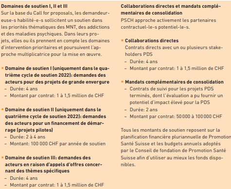

```{r echo = FALSE}
#' Plot number of each level of a nominal variable
#' 
#' @param tbl A tibble or data.frame
#' @param colum The name of the column holding the nominal variable. 
#' Use tidy notation. No quotes needed.
#' 
#' @return A ggplot object
#' 
#' @importFrom dplyr count
#' @importFrom ggplot2 ggplot aes geom_col
quick_summary_nominal_variable <- function(
    tbl, 
    column
) {
  tbl_summary <- tbl |> 
    count({{column}}) |> 
    # Sort level in descending order
    mutate(
      {{column}} := forcats::fct_reorder(
        .f = {{column}}, 
        .x = n
      )
    )
  
  ggplot(tbl_summary) +
    aes(x = {{column}},y = n) +
    geom_col(
      fill = "#28A7B4"
    ) +
    coord_flip()+
    labs(
      # Use column name as plot title
      title = deparse(substitute(column)),
      x = ""
    )
}
```

```{r message = FALSE}
library(readxl)
library(readr)
library(dplyr)
library(here)
library(janitor)
library(ggplot2)
library(gtExtras)
library(lubridate)
library(tidyr)
```

```{r, include=FALSE}
knitr::opts_chunk$set(
  echo = FALSE,
  fig.width = 7
)
```


# Import des données

Importer les données brutes

```{r echo = TRUE}
data_psch <- read_excel(
  path = here("inst/PGV.xlsx"), 
)
```

Importer le dictionnaire des noms de variables (Français/Allemand)

```{r echo = TRUE}
dic_variables <- read_csv(
  file = here("inst/dic_variables.csv"),
  show_col_types = FALSE
)
```

# Nettoyage des données

## Uniformisation des nom de colonnes

Retirer le premier rang qui contient certains noms de colonnes en Français

```{r echo = TRUE}
data_psch <- data_psch[-1, ] 
```

Remplacer les noms de colonnes allemands par les noms français.

```{r echo = TRUE}
colnames(data_psch) <- dic_variables$fr[
  match(
    dic_variables$de, 
    names(data_psch)
  )
]
```

Simplifier les noms de colonnes (retirer majuscules et espaces)

```{r echo = TRUE}
data_psch <- janitor::clean_names(data_psch)
```

## Convertion au format numérique

Les séparateurs de milliers ne sont pas uniformes dans les colonnes traitant du budget.

```{r}
data_psch |> 
  filter(
    if_any(
      starts_with("budget"), 
      ~ !grepl("^\\d", .x)
    )
  ) |> 
  select(titre_court, starts_with("budget")) |> pull(budget_psch)
```

Supprimer les mentions à la devise et les séparateurs de milliers non parsés dans les colonnes budget.

```{r}
data_psch <- data_psch |> 
  mutate(
    across(
      starts_with("budget"),
      ~ gsub("^CHF\\s+|\\'", "", .x)
    )
  ) 
```

```{r}
data_without_CHF_or_quote_as_grouping_mark <- data_psch |>
  filter(
    if_any(
      starts_with("budget"), 
      ~ grepl("^CHF|\\'", .x)
    )
  ) |> 
  nrow() == 0
stopifnot(data_without_CHF_or_quote_as_grouping_mark)
```


Convertir les colonnes traitant du budget au format numérique

```{r echo = TRUE}
data_psch <- data_psch |> 
  mutate(
    across(
      starts_with("budget"),
      as.numeric
    )
  )
```

## Traductions

Traduction de certaines colonnes en Français

```{r echo = TRUE}
data_psch <- data_psch |> 
  mutate(
    statut = case_when(
      statut == "Umsetzung" ~ "Mise en oeuvre",
      statut == "Abschluss" ~ "Finalis?",
      statut == "Abbruch" ~ "Interrompu"
    ),
    domaine_de_soutien = case_when(
      domaine_de_soutien == "Direkte Zusammenarbeit" ~ "Collaboration directe",
      domaine_de_soutien == "Folgemandat" ~ "Mandat de suivi",
      domaine_de_soutien == "Förderbereich I" ~ "Domaine de financement I",
      domaine_de_soutien == "Förderbereich II" ~ "Domaine de financement II",
      domaine_de_soutien == "Förderbereich III" ~ "Domaine de financement III",
      domaine_de_soutien == "Förderbereich IV" ~ "Domaine de financement IV"
    )
  )
```

# Exploration univariées

## titre_court

Est-ce que `titre_court` correspond à un identifiant unique de chauque projet ? :  `r length(unique(data_psch$titre_court)) == length(data_psch$titre_court)`

## statut

```{r}
quick_summary_nominal_variable(
  tbl = data_psch,
  column = statut
)
```

## langue

```{r}
quick_summary_nominal_variable(
  tbl = data_psch,
  column = langue
) 
```

Projet avec une langue annoncée différente à celle de la description

```{r}
data_psch |> 
  filter(titre_court == "RCA PGV03.085") |> 
  select(langue, description)
```

Vu avec Raphael, on change pour du Français (Französisch).

```{r}
data_psch[data_psch$titre_court == "RCA PGV03.085", ]$langue <- "Französisch" 
```


## cycle_de_soutien

```{r}
quick_summary_nominal_variable(
  tbl = data_psch,
  column = cycle_de_soutien
)
```

Il y a plusieurs cycles de soutiens pour les années 2022 et 2023.

Outre l'année, on semble distinguer deux types de cycles de soutien:

- `PGV0\\d`pout toutes les années
- `PGV_FM` uniquement pour 2022 et 2023

`_FM` pour "Folgemandat" (Mandat de suvi) sont des projets commencés lors d’appel d’offre antérieurs qui sont prolongés par de nouveaux financements.

## domaine_de_soutien

```{r}
quick_summary_nominal_variable(
  tbl = data_psch,
  column = domaine_de_soutien
)
```

Domaine de financement : correspond à des lancement d’appels d’offres. Les grades I à IV correspondent à des budgets financement croissants et à des durées annuelles différentes.

Mandat de suivi : correpond à des mandats de suivis, .i.e des prolongations de projets déjà financés

Collaboration directe : correspond à des collaborations directes entre PSCH et d’autres entités



## debut_du_projet/fin_du_projet

```{r}
data_psch |> 
  select(
    ends_with("_du_projet")
  ) |>
  mutate(
    duree_projet = time_length(
      interval(
        start = debut_du_projet, 
        end = fin_du_projet
      ),
      unit = "month" 
    )
  ) |> 
  gtExtras::gt_plt_summary(
    title = "Dates de début et fin de projet et durée d'un projet"
  )
```


## description

Est-ce que `description` est propre à chaque projet ? : `r length(unique(data_psch$description)) == length(data_psch$description)`

Il existe deux projets avec la même description.

Ils ont des titres similaires mais des langues différentes et ne correpondent pas aux mêmes cycles de soutien.

```{r echo = TRUE}
data_psch |> 
  filter(
    duplicated(description) | 
      duplicated(description, fromLast = TRUE)
  ) |> 
  select(
    titre_court,
    langue, cycle_de_soutien
  )
```


## etendu

```{r}
data_psch |> 
  select(
    titre_court, 
    etendu
  ) |> 
  tidyr::separate_rows(
    etendu,
    sep = ",\r\n"
  ) |> 
  count(titre_court) |> 
  ggplot()+
  aes(x = n, y = 1) +
  geom_violin(
    alpha = 0.4,
    na.rm = TRUE,
    fill =  "#28A7B4"
  ) +
  geom_jitter(
    alpha = 0.55,
    na.rm = TRUE,
    width = 0
  ) +
  labs(
    y = "",
    title = "Nombre de cantons ciblés par projet"
  )+
  theme(
    axis.text.y = element_blank(),
    axis.ticks = element_blank()
  ) 
```


## theme

```{r}
data_psch |> 
  select(titre_court, theme) |> 
  tidyr::separate_rows(
    theme,
    sep = ",\r\n"
  ) |> 
  count(titre_court) |> 
  ggplot()+
  aes(x = n, y = 1) +
  geom_violin(
    alpha = 0.4,
    na.rm = TRUE,
    fill =  "#28A7B4"
  ) +
  geom_jitter(
    alpha = 0.55,
    na.rm = TRUE,
    width = 0
  ) +
  labs(
    y = "",
    title = "Nombre de thématiques abordées par projet"
  )+
  theme(
    axis.text.y = element_blank(),
    axis.ticks = element_blank()
  )
```


## organisation_principale

La plupart des associations participent à un projet au plus deux.

```{r}
data_psch |> 
  count(organisation_principale) |> 
  ggplot()+
  aes(x = n, y = 1)+
  geom_dotplot(
    alpha = 0.5,
    binwidth = 1/115
  ) +
  theme(
    axis.text.y = element_blank(),
    axis.ticks = element_blank()
  ) +
  labs(
    y = "",
    title = "Nombre de projets par association"
  )
```

## code_postal_organisation_principale

```{r}
quick_summary_nominal_variable(
  tbl = data_psch,
  column = code_postal_organisation_principale
)
```


## ville_organisation_principale

```{r}
quick_summary_nominal_variable(
  tbl = data_psch,
  column = ville_organisation_principale
)
```


## type_dorganisation

```{r}
quick_summary_nominal_variable(
  tbl = data_psch,
  column = type_dorganisation
)
```


## chef_de_projet

```{r}
quick_summary_nominal_variable(
  tbl = data_psch,
  column = chef_de_projet
)
```

## budget_psch/budget_org_resp/budget_tiers/budget_total

```{r}
data_psch |> 
  select(
    starts_with("budget_")
  ) |> 
  gtExtras::gt_plt_summary(
    title = "Varibles liées au budget (CHF)"
  )
```


```{r}
data_psch |> 
  select(
    starts_with("budget_")
  ) |> 
  pivot_longer( 
    cols = starts_with("budget_"),
    names_to = "type",
    values_to = "chf"
  ) |> 
  ggplot() +
  aes(x = type, y = chf) +
  geom_violin(
    alpha = 0.4,
    na.rm = TRUE,
    fill =  "#28A7B4"
  ) +
  ggbeeswarm::geom_quasirandom(
    alpha = 0.55,
    na.rm = TRUE
  )
```


### Somme totale investie sur quatre ans

```{r}
data_psch |> 
  summarise(
    somme_total_investie = sum(budget_total, na.rm = TRUE)
  )
```

## Variables commenmçant par `pi_`

`pi` : Prioritärer Interventionsbereich = Domaine d'intervention prioritaire


`pi_1_` : Critères obligatoires pour financement du projet. Doivent normalement tous êtres respectés.

- pi_1_interfaces
- pi_1_parcours_sante
- pi_1_autogestion


`pi_2_` : Crtères optionnel. Les porteurs de projets doivent en choisir au moins un.

- pi_2_formation
- pi_2_nouvelles_tech
- pi_2_economicite

Ces variables ont deux niveaux :

- soit `"X"` (critère sastifait)
- soit `NA` (critère NON-satisfait)

```{r}
data_pourcentage_presence_pi <- data_psch |> 
  select(starts_with("pi_")) |> 
  pivot_longer(
    cols = starts_with("pi_"),
    names_to = "categorie",
    values_to = "valeur"
  ) |> 
  group_by(categorie, valeur) |> 
  summarise(
    n = n(),
    .groups = "drop"
  ) |> 
  arrange(
    categorie
  ) |> 
  mutate(
    valeur = case_when(
      valeur == "X" ~ "present",
      is.na(valeur) ~ "absent"
    )
  ) |> 
  pivot_wider(
    names_from = valeur,
    values_from = n
  ) |> 
  mutate(
    pourcentage_presence = (present / (present + absent)) * 100
  ) 

ggplot(
  data = data_pourcentage_presence_pi
) +
  aes(
    x = pourcentage_presence, 
    y = forcats::fct_reorder(
      .f = categorie,
      .x = pourcentage_presence
    )
  ) + 
  geom_col(
    fill = "#28A7B4"
  ) +
  labs(
    x = "%",
    y = "",
    title = "Pourcentage présence pour chaque catégories PI"
  )
```


```{r}
data_psch |> 
  select(
    starts_with("pi_")
  ) |> 
  gtExtras::gt_plt_summary(
    title = "Variables commençantpar 'pi_'"
  )
```

## Colonnes redondantes par rapport à theme

Les colonnes suivante contiennent la même information que la colonne theme mais 
sous forme binaire (0/1) :

- maladies_respiratoires
- diabete
- maladies_cardiovasculaires
- cancer
- tms
- maladies_psychiques
- addiction
- autres_mnt
- autres_themes

```{r}
data_psch |> 
  select(
    maladies_respiratoires:autres_themes
  ) |> 
  gtExtras::gt_plt_summary(
    title = "Variables de thèmes binaires"
  )
```


## Facteurs de risque comportementaux

Correspondant à un risque accru de déclencher une maladie non transmissible

```{r}
facteurs_de_risque_par_projet <- data_psch |> 
  select(
    titre_court, 
    facteurs_de_risque
  ) |> 
  tidyr::separate_rows(
    facteurs_de_risque,
    sep = ", "
  ) 

facteurs_de_risque_par_projet |> 
  distinct(facteurs_de_risque) |> 
  pull()
```


```{r}
facteurs_de_risque_par_projet |> 
  count(titre_court) |> 
  ggplot()+
  aes(x = n, y = 1) +
  geom_violin(
    alpha = 0.4,
    na.rm = TRUE,
    fill =  "#28A7B4"
  ) +
  geom_jitter(
    alpha = 0.55,
    na.rm = TRUE,
    width = 0
  ) +
  labs(
    y = "",
    title = "Nombre de facteurs de risque ciblés par projet"
  )+
  theme(
    axis.text.y = element_blank(),
    axis.ticks = element_blank()
  ) 
```


## Groupe cible


```{r}
groupe_cible_par_projet <- data_psch |> 
  select(
    titre_court, 
    groupe_cible
  ) |> 
  tidyr::separate_rows(
    groupe_cible,
    sep = ", "
  ) 

groupe_cible_par_projet |> 
  distinct(groupe_cible) |> 
  pull()
```


```{r}
groupe_cible_par_projet |> 
  count(titre_court) |> 
  ggplot()+
  aes(x = n, y = 1) +
  geom_violin(
    alpha = 0.4,
    na.rm = TRUE,
    fill =  "#28A7B4"
  ) +
  geom_jitter(
    alpha = 0.55,
    na.rm = TRUE,
    width = 0
  ) +
  labs(
    y = "",
    title = "Nombre de groupe cibles par projet"
  )+
  theme(
    axis.text.y = element_blank(),
    axis.ticks = element_blank()
  ) 
```


## Multiplicateurs

Catégories cibles de personnels soignants, population et qui vont participer à “multiplier” le projet, à le diffuser (des médecins, des secrétaires médicales, etc.)

```{r}
multiplicateurs_par_projet <-  data_psch |> 
  select(
    titre_court, 
    multiplicateurs
  ) |> 
  tidyr::separate_rows(
    multiplicateurs,
    sep = ", "
  ) 

multiplicateurs_par_projet |> 
  distinct(multiplicateurs) |> 
  pull()
```


```{r}
multiplicateurs_par_projet |> 
  count(titre_court) |> 
  ggplot()+
  aes(x = n, y = 1) +
  geom_violin(
    alpha = 0.4,
    na.rm = TRUE,
    fill =  "#28A7B4"
  ) +
  geom_jitter(
    alpha = 0.55,
    na.rm = TRUE,
    width = 0
  ) +
  labs(
    y = "",
    title = "Type(s) de multiplicateurs ciblés par projet"
  )+
  theme(
    axis.text.y = element_blank(),
    axis.ticks = element_blank()
  ) 
```


## Setting

Lieux où se déroulent les interventions


```{r}
settings_par_projet <-  data_psch |> 
  select(
    titre_court, 
    settings
  ) |> 
  tidyr::separate_rows(
    settings,
    sep = ", "
  ) 

settings_par_projet |> 
  distinct(settings) |> 
  pull()
```


```{r}
settings_par_projet |> 
  count(titre_court) |> 
  ggplot()+
  aes(x = n, y = 1) +
  geom_violin(
    alpha = 0.4,
    na.rm = TRUE,
    fill =  "#28A7B4"
  ) +
  geom_jitter(
    alpha = 0.55,
    na.rm = TRUE,
    width = 0
  ) +
  labs(
    y = "",
    title = "Type(s) de settings ciblés par projet"
  )+
  theme(
    axis.text.y = element_blank(),
    axis.ticks = element_blank()
  ) 
```

