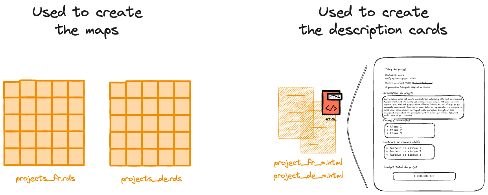

```{r, include = FALSE}
knitr::opts_chunk$set(
  collapse = TRUE,
  comment = "#>"
)
```

```{r setup}
library(exploratorium)
```

<!-- WARNING - This vignette is generated by {fusen} from dev/flat_prepare_data.Rmd: do not edit by hand -->

```{r include = FALSE}
knitr::opts_chunk$set(
  eval=FALSE,
  echo=TRUE
)
```

*The aim of this article is to show you how to update the data used by the app.*

The app uses 2 types of data: 

- Projects data saved in a .rds format with all the data
- Projects cards in a .html format


```{r echo = FALSE, eval = TRUE, fig.align = 'center', out.width = '40%'}

```

The data preparation workflow is shown below. **This data preparation process must be repeated each time the raw data is modified or each time a modification is required to the data dictionaries.**


```{r echo = FALSE, eval = TRUE, fig.align = 'center', out.width = '100%'}
knitr::include_graphics("../man/figures/data_prep_workflow.png")
```

# Modify the raw data about the projects or modify the translations

## Modify the raw data about the projects

You must upload the new version of the file `PGV.xlsx` in the `inst/data-projects-raw` folder.


```{r echo = FALSE, eval = TRUE, fig.align = 'center', out.width = '20%'}
knitr::include_graphics("../man/figures/update_raw_projects_data.png")
```

## Modify the data concerning the translations

You must modify directly the dictionaries used for the translations. They are saved in the `inst/data-dic` folder, in a `.csv` format.


```{r echo = FALSE, eval = TRUE, fig.align = 'center', out.width = '80%'}
knitr::include_graphics("../man/figures/update_dic_data.png")
```

### dic_variables.csv

The content of **"dic_variables.csv"** is the following one:


```{r echo = FALSE, eval = TRUE, message = FALSE, warning = FALSE}
DT::datatable(
  readr::read_csv2(
    system.file(
      "data-dic",
      "dic_variables.csv", 
      package = "exploratorium"
    )
  )
)
```

### dic_cantons.csv

The content of **"dic_cantons.csv"** is the following one:


```{r echo = FALSE, eval = TRUE, message = FALSE, warning = FALSE}
DT::datatable(
  readr::read_csv(
    system.file(
      "data-dic",
      "dic_cantons.csv", 
      package = "exploratorium"
    )
  )
)
```

  

### dic_values.csv

The content of **"dic_values.csv"** is the following one:


```{r echo = FALSE, eval = TRUE, message = FALSE, warning = FALSE}
DT::datatable(
  readr::read_csv2(
    system.file(
      "data-dic",
      "dic_values.csv", 
      package = "exploratorium"
    )
  )
)
```

### dic_titles_app.csv and i18n_locales.json

The content of **"dic_titles_app.csv"** is the following one:


```{r echo = FALSE, eval = TRUE, message = FALSE, warning = FALSE}
DT::datatable(
  readr::read_csv2(
    system.file(
      "data-dic",
      "dic_titles_app.csv", 
      package = "exploratorium"
    )
  )
)
```

The content of **"i18n_locales.json"** is the following one:


```{r echo = FALSE, eval = TRUE, message = FALSE, warning = FALSE}
json_content <- jsonlite::fromJSON(
  system.file(
    "app",
    "www",
    "i18n_locales.json",
    package = "exploratorium"
  )
)

translations_tibble <- tibble::tibble(
  id = names(unlist(json_content$de$translation)),
  de = unlist(json_content$de$translation),
  fr = unlist(json_content$fr$translation)
)

DT::datatable(
  translations_tibble
)
```

# Update the data used by the app

Then, to update the data used by the application, you can use the `prepare_app_data()` function as follows:


  

```{r example-prepare_app_data, echo = FALSE}
# Load the toy datasets
data("toy_data_pgv")
data("toy_dic_variables")
data("toy_dic_cantons")
data("toy_dic_titles_pages")
data("toy_cantons_sf")

# Create a temp folder with data-projects-raw and ata-projects subfolder
my_temp_dir <- tempfile("test-prepare-data")
dir.create(my_temp_dir)
dir.create(file.path(my_temp_dir, "data-projects-raw"))
dir.create(file.path(my_temp_dir, "data-projects"))
dir.create(file.path(my_temp_dir, "data-projects-cards"))

# Save the toy PGV file inside
writexl::write_xlsx(
  toy_data_pgv, 
  file.path(
    my_temp_dir, 
    "data-projects-raw", 
    "toy_PGV.xlsx"
  )
)

# Prepare the data
prepare_app_data(
  name_raw_file = "toy_PGV.xlsx",
  pkg_dir = my_temp_dir, 
  dic_variables = toy_dic_variables, 
  dic_cantons = toy_dic_cantons,
  dic_titles_pages = toy_dic_titles_pages,
  cantons_sf = toy_cantons_sf
)

# Delete the tempdir
unlink(my_temp_dir, recursive = TRUE)
```

```{r}
prepare_app_data()
```

