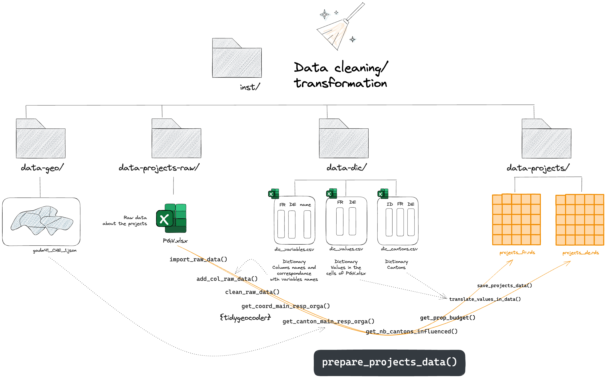
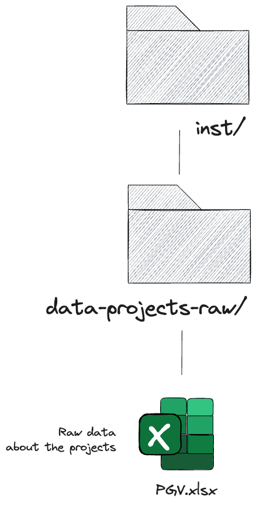
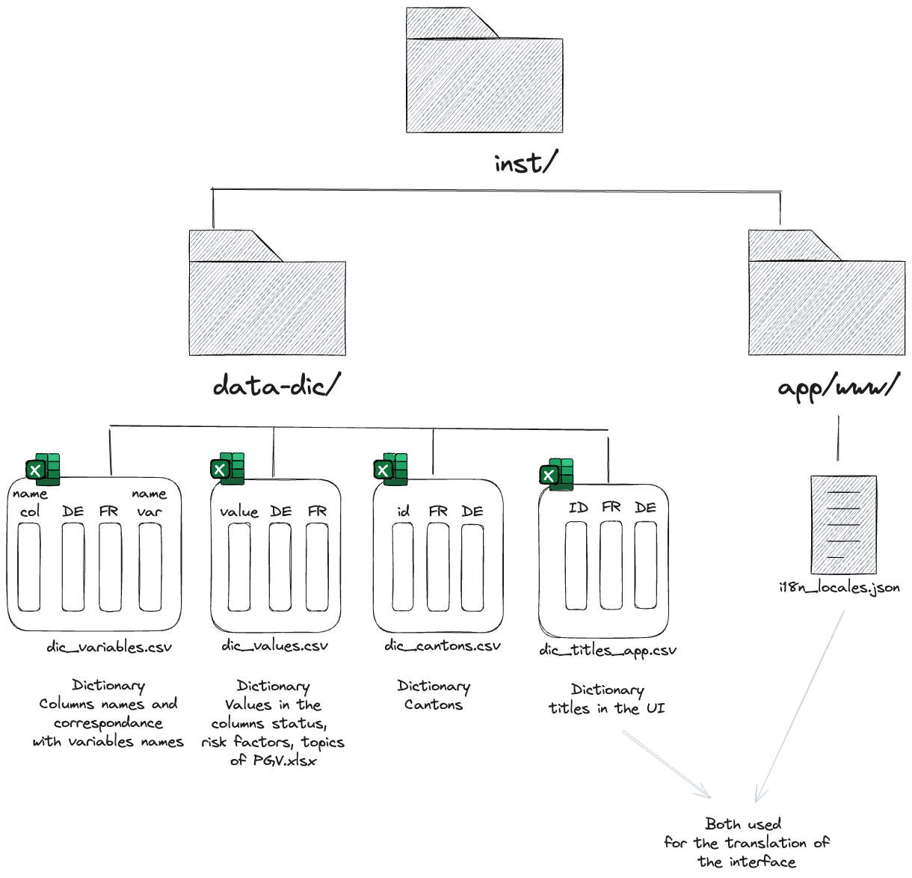

```{r, include = FALSE}
knitr::opts_chunk$set(
  collapse = TRUE,
  comment = "#>"
)
```

```{r setup}
library(observatoire)
```

<!-- WARNING - This vignette is generated by {fusen} from dev/flat_prepare_data.Rmd: do not edit by hand -->

```{r include = FALSE}
knitr::opts_chunk$set(
  eval=FALSE,
  echo=TRUE
)
```

*The aim of this article is to show you how to update the data used by the app.*

The data preparation workflow is shown below. **This data preparation process must be repeated each time the raw data is updated or each time a modification is required to the data dictionaries.**


```{r echo = FALSE, eval = TRUE, fig.align = 'center'}

```

# Update the raw data concerning the projects

You must upload the new version of the file `PGV.xlsx` in the `inst/data-projects-raw` folder.


```{r echo = FALSE, eval = TRUE, fig.align = 'center', out.width = '20%'}

```

# Update the data concerning the translations

You must modify directly the dictionaries used for the translations. They are saved in the `inst/data-dic` folder, in a `.csv` format.


```{r echo = FALSE, eval = TRUE, fig.align = 'center', out.width = '20%'}

```

The content of **"dic_variables.csv"** is the following one:


```{r echo = FALSE, eval = TRUE, message = FALSE, warning = FALSE}
DT::datatable(
  readr::read_csv2(
    system.file(
      "data-dic",
      "dic_variables.csv", 
      package = "observatoire"
    )
  )
)
```

The content of **"dic_cantons.csv"** is the following one:


```{r echo = FALSE, eval = TRUE, message = FALSE, warning = FALSE}
DT::datatable(
  readr::read_csv(
    system.file(
      "data-dic",
      "dic_cantons.csv", 
      package = "observatoire"
    )
  )
)
```

  
The content of **"dic_values.csv"** is the following one:


```{r echo = FALSE, eval = TRUE, message = FALSE, warning = FALSE}
#TODO
```

# Prepare/update the data used by the app

Then, to update the data concerning the projects used by the application, you can use the `prepare_projects_data()` function as follows:


  

```{r example-prepare_projects_data}
prepare_projects_data()
```

